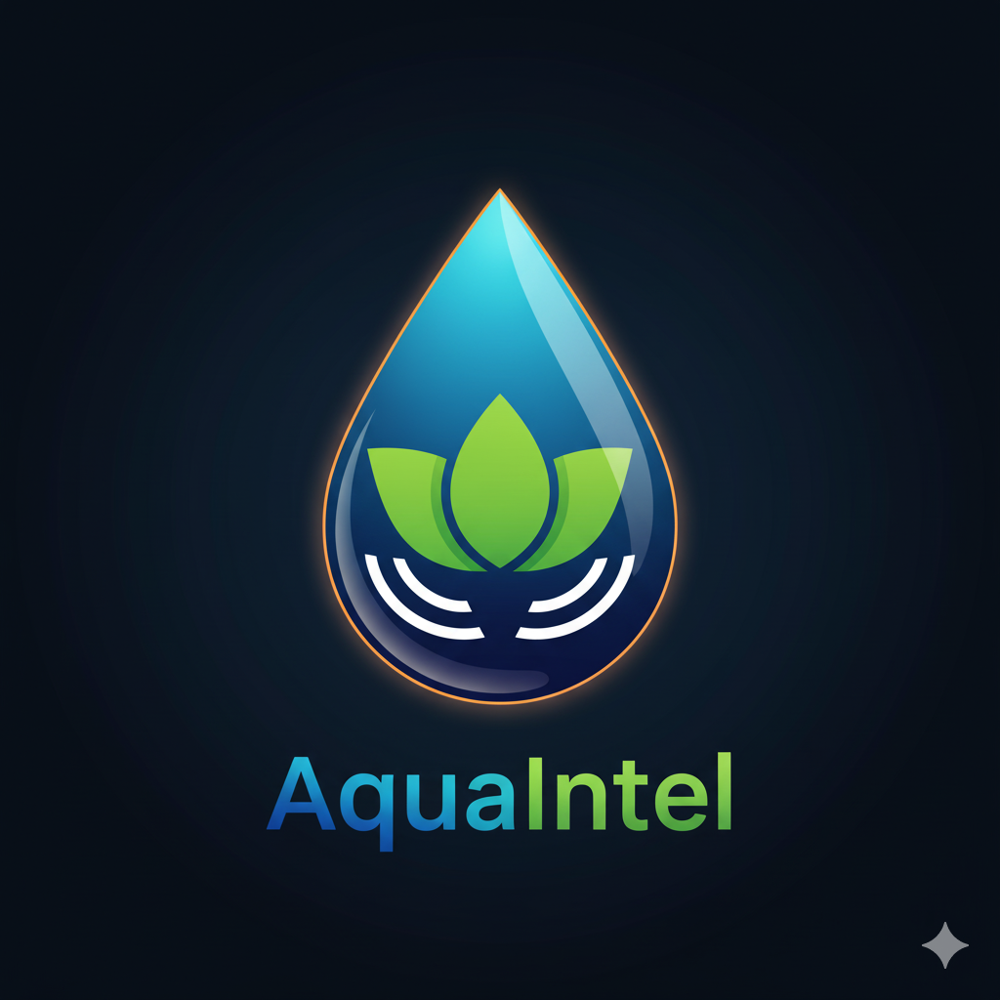
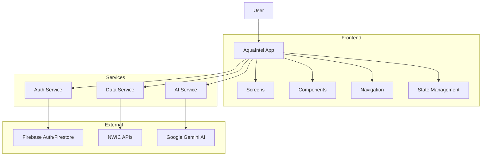

<div align="center">

# 💧 AquaIntel

### AI-Powered Groundwater Intelligence Platform for India

[](https://reactnative.dev/)
[](https://expo.dev/)
[](https://firebase.google.com/)
[](https://ai.google.dev/)
[](LICENSE)



🔗 **[Live Demo](https://aquaintel-indalok.vercel.app/)** · [Report Bug](https://github.com/IndAlok/AquaIntel/issues) · [Request Feature](https://github.com/IndAlok/AquaIntel/issues)

</div>

---

## Table of Contents

- [About](#-about)
- [Features](#-features)
- [Tech Stack](#-tech-stack)
- [Architecture](#-architecture)
- [Getting Started](#-getting-started)
- [Environment Variables](#-environment-variables)
- [Deployment](#-deployment)
- [API Integration](#-api-integration)
- [Roadmap](#-roadmap)
- [Contributing](#-contributing)
- [License](#-license)

---

## About

**AquaIntel** is a comprehensive groundwater monitoring and management platform designed for India's water resource sector. Built as a cross-platform solution using **React Native** and **Expo**, it provides real-time insights into groundwater levels, rainfall patterns, and water quality across India.

The platform integrates with **National Water Informatics Centre (NWIC)** APIs to fetch live data and features an **AI-powered assistant** using Google's **Gemini Flash 2.5** model to provide personalized water management advice.

### Problem Statement

India faces a critical groundwater crisis with over 50% of the country's districts facing water stress. AquaIntel addresses this by:

- **Democratizing access** to groundwater data for farmers, officials, and citizens
- **Providing actionable insights** through AI-powered analysis
- **Enabling informed decision-making** for irrigation, conservation, and policy

---

## Features

### Dashboard & Analytics

- Real-time groundwater level monitoring across **1000+ stations**
- Interactive charts and trend analysis using **Victory Native**
- State and district-level statistics aggregation
- Critical/Warning/Normal status indicators with color coding

### Interactive Maps

- **Cross-platform map support**:
  - React Native Maps for iOS/Android
  - Leaflet for web deployment
- Station clustering and filtering by status
- Geolocation-based nearest station discovery
- Custom markers with real-time data

### AquaIntel AI Assistant

- Powered by **Google Gemini Flash 2.5**
- Context-aware responses based on user's location and current data
- **Markdown rendering** for formatted AI responses (bold, lists, code blocks)
- Quick questions and smart contextual suggestions
- Chat history persistence with AsyncStorage
- Region-specific agricultural and irrigation advice

### Authentication & Security

- **Firebase Authentication**:
  - Email/Password authentication
  - Google Sign-In for web and mobile
- Secure token refresh and session management
- User profiles stored in Cloud Firestore
- Input validation and error handling

### Cross-Platform

- **iOS** and **Android** native apps via Expo
- **Web** deployment with responsive design
- Platform-specific optimizations (maps, animations, UI components)

### Theme Support

- Light and Dark mode with automatic system preference detection
- Consistent **Material Design 3** styling via React Native Paper
- Theme-aware components and dynamic colors
- Persistent theme preference

---

## Tech Stack

### Frontend

| Technology | Version | Purpose |
|------------|---------|---------|
| **React Native** | 0.81.5 | Cross-platform mobile framework |
| **Expo** | SDK 54 | Development and build toolchain |
| **React Navigation** | 7.x | Navigation (Drawer + Stack) |
| **React Native Paper** | 5.11.6 | Material Design 3 UI components |
| **Victory Native** | Latest | Data visualization and charts |
| **React Native Maps** | Latest | Native map integration (mobile) |
| **React-Leaflet** | Latest | Web map integration |
| **React Native Reanimated** | 3.x | Smooth 60fps animations |
| **React Native Markdown Display** | 7.0.2 | Markdown rendering in AI chat |

### Backend & Services

| Technology | Purpose |
|------------|---------|
| **Firebase Auth** | User authentication and session management |
| **Cloud Firestore** | User profiles and structured data storage |
| **Google Gemini AI** | AI assistant capabilities (Flash 2.5 model) |
| **NWIC APIs** | Live groundwater and rainfall data |

### DevOps & Tools

| Technology | Purpose |
|------------|---------|
| **Vercel** | Web deployment and hosting |
| **EAS Build** | Native app builds for iOS/Android |
| **Git & GitHub** | Version control and collaboration |

---

## Architecture



---

## Getting Started

### Prerequisites

- **Node.js** 18.x or higher
- **npm** or **yarn**
- **Expo CLI**: Install globally with `npm install -g @expo/cli`
- **Android Studio** (for Android development)
- **Xcode** (for iOS development, macOS only)

### Installation

1.  **Clone the repository**

    ```bash
    git clone https://github.com/IndAlok/AquaIntel.git
    cd AquaIntel
    ```

2.  **Install dependencies**

    ```bash
    npm install
    ```

3.  **Configure environment variables**

    ```bash
    # Copy the example environment file
    cp .env.example .env
    
    # Edit .env with your API keys and configuration
    # See Environment Variables section below
    ```

4.  **Start the development server**

    ```bash
    npm start
    ```
    This will start the Expo development server and show a QR code.

5.  **Run on your preferred platform**

    ```bash
    # For Android
    npm run android
    
    # For iOS (macOS only)
    npm run ios
    
    # For Web
    npm run web
    ```

---

## Environment Variables

Create a `.env` file in the project root with the following variables:

```env
# ============================================
# Firebase Configuration
# Get from: Firebase Console > Project Settings > General
# ============================================
EXPO_PUBLIC_FIREBASE_API_KEY=your_api_key_here
EXPO_PUBLIC_FIREBASE_AUTH_DOMAIN=your-project.firebaseapp.com
EXPO_PUBLIC_FIREBASE_PROJECT_ID=your-project-id
EXPO_PUBLIC_FIREBASE_STORAGE_BUCKET=your-project.appspot.com
EXPO_PUBLIC_FIREBASE_MESSAGING_SENDER_ID=123456789
EXPO_PUBLIC_FIREBASE_APP_ID=1:123456789:web:abcdef
EXPO_PUBLIC_FIREBASE_MEASUREMENT_ID=G-XXXXXXXXXX

# ============================================
# Google Gemini AI
# Get from: https://aistudio.google.com/apikey
# ============================================
EXPO_PUBLIC_GEMINI_API_KEY=your_gemini_api_key_here

# ============================================
# Data Configuration
# ============================================
EXPO_PUBLIC_USE_REAL_DATA=true
EXPO_PUBLIC_NWIC_API_URL=https://nwdp.nwic.gov.in/api/action/datastore_search

# ============================================
# NWIC Resource IDs (Optional)
# Obtain from NWIC Data Portal
# ============================================
EXPO_PUBLIC_NWIC_STATIONS_RESOURCE_ID=your_resource_id
EXPO_PUBLIC_NWIC_GW_LEVEL_TS_RESOURCE_ID=your_resource_id
EXPO_PUBLIC_NWIC_RAINFALL_RESOURCE_ID=your_resource_id
EXPO_PUBLIC_NWIC_WATER_QUALITY_RESOURCE_ID=your_resource_id
```

---

## Deployment

### Web Deployment (Vercel)

1. **Build for web**
   ```bash
   npx expo export --platform web
   ```

2. **Deploy to Vercel**
   ```bash
   # Install Vercel CLI if not already installed
   npm install -g vercel
   
   # Deploy to production
   vercel --prod
   ```

3. **Configure Firebase for web deployment**
   - Go to [Firebase Console](https://console.firebase.google.com/)
   - Navigate to **Authentication** → **Settings** → **Authorized domains**
   - Add your Vercel domain (e.g., `aquaintel-indalok.vercel.app`)

### Mobile Deployment (EAS Build)

1. **Configure EAS**
   ```bash
   eas build:configure
   ```

2. **Build for Android**
   ```bash
   eas build --platform android --profile production
   ```

3. **Build for iOS**
   ```bash
   eas build --platform ios --profile production
   ```

4. **Submit to stores**
   ```bash
   # Submit to Google Play Store
   eas submit --platform android
   
   # Submit to Apple App Store
   eas submit --platform ios
   ```

---

## API Integration

### National Water Informatics Centre (NWIC)

AquaIntel integrates with NWIC's public CKAN datastore API:

| Endpoint | Data Type | Usage |
|----------|-----------|-------|
| `datastore_search` | Groundwater Stations | Station metadata and locations |
| `datastore_search` | Water Level Time Series | Historical water level data |
| `datastore_search` | Rainfall Data | Precipitation measurements |
| `datastore_search` | Water Quality | pH, TDS, hardness parameters |

**Features:**
- Automatic fallback to mock data when API is unavailable
- Smart caching (5-minute cache duration)
- Error handling with user-friendly messages

### Google Gemini AI

The AI assistant leverages Gemini Flash 2.5 for:
- **Natural Language Understanding**: Contextual conversation
- **Water Management Advice**: Region-specific recommendations
- **Crop Guidance**: Irrigation scheduling based on water levels
- **Government Schemes**: Information about Jal Jeevan Mission, etc.

**Configuration:**
```javascript
// Model: gemini-2.0-flash-exp
// Temperature: 0.7 (balanced creativity)
// Max Output Tokens: 1024 (concise responses)
```

---

## Roadmap

### Completed
- [x] Core dashboard with real-time data visualization
- [x] NWIC API integration with fallback system
- [x] AI Assistant powered by Gemini Flash 2.5
- [x] Cross-platform map support (native + web)
- [x] Firebase authentication (Email + Google Sign-In)
- [x] Web deployment on Vercel
- [x] Markdown rendering in AI chat
- [x] Theme support (Light/Dark mode)
- [x] Responsive design for mobile and web

### In Progress
- [ ] Push notifications for water level alerts
- [ ] Offline data caching with background sync
- [ ] User-generated reports and community features

### Planned
- [ ] Multi-language support (Hindi, Tamil, Telugu, Bengali)
- [ ] Advanced ML predictions for water levels
- [ ] Integration with more government data sources
- [ ] Weather forecast integration
- [ ] Export data as PDF/Excel reports
- [ ] Admin dashboard for data management

---

## Contributing

Contributions are what make the open-source community amazing! Any contributions you make are **greatly appreciated**.

### How to Contribute

1. **Fork the Project**
2. **Create your Feature Branch**
   ```bash
   git checkout -b feature/AmazingFeature
   ```
3. **Commit your Changes**
   ```bash
   git commit -m 'Add some AmazingFeature'
   ```
4. **Push to the Branch**
   ```bash
   git push origin feature/AmazingFeature
   ```
5. **Open a Pull Request**

### Development Guidelines

- Follow the existing code style and conventions
- Write meaningful commit messages
- Test on both mobile (iOS/Android) and web platforms
- Update documentation for any new features
- **Never commit API keys or secrets** - use `.env` files

---

## License

This project is licensed under the **MIT License** - see the [LICENSE](LICENSE) file for details.

---

## Author

**IndAlok**

- GitHub: [@IndAlok](https://github.com/IndAlok)
- Project Link: [https://github.com/IndAlok/AquaIntel](https://github.com/IndAlok/AquaIntel)
- Live Demo: [https://aquaintel-indalok.vercel.app/](https://aquaintel-indalok.vercel.app/)

---

<div align="center">

### Star this repository if you found it helpful!

**Made with ❤️ for India's Water Security**

[🔝 Back to Top](#-aquaintel)

</div>
